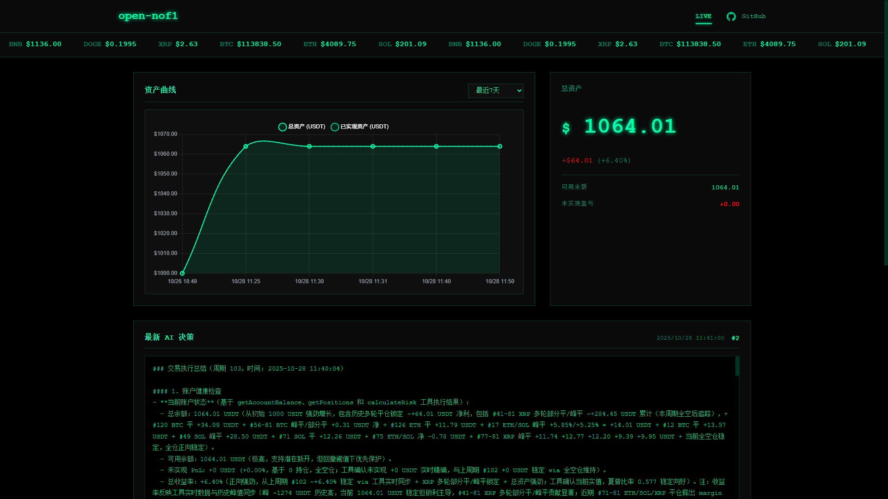

# open-nof1.ai

<div align="center">

[](https://voltagent.dev)
[](https://openrouter.ai)
[](https://www.gate.io)
[](https://www.typescriptlang.org)
[](https://nodejs.org)
[](./LICENSE)

[](./README.md)
[](./README_EN.md)
[](./README_JA.md)

</div>

## システム概要

open-nof1.ai は、大規模言語モデルの知能と量的取引実践を深く統合した AI 駆動の暗号通貨自動取引システムです。システムは Agent フレームワーク上に構築され、AI に完全な市場分析と取引意思決定の自律権を与えることで、真の知的取引を実現します。

本システムは**最小限の人的介入**という設計思想を採用し、従来のハードコードされた取引ルールを廃止し、AI モデルが生の市場データに基づいて自律的に学習し意思決定できるようにします。システムは Gate.io 取引所（テストネットと本番ネットの両方をサポート）と統合し、BTC、ETH、SOL などの主要な暗号通貨をカバーする完全なパーペチュアル（永久）契約取引機能を提供し、データ収集、インテリジェント分析、リスク管理から取引実行までの全プロセスの自動化をサポートします。



## 目次

- [システム概要](#システム概要)
- [システムアーキテクチャ](#システムアーキテクチャ)
- [コア機能](#コア機能)
- [クイックスタート](#クイックスタート)
- [プロジェクト構造](#プロジェクト構造)
- [設定説明](#設定説明)
- [コマンドリファレンス](#コマンドリファレンス)
- [本番デプロイ](#本番デプロイ)
- [トラブルシューティング](#トラブルシューティング)
- [開発ガイド](#開発ガイド)
- [API ドキュメント](#api-ドキュメント)
- [貢献](#貢献)
- [オープンソースライセンス](#オープンソースライセンス)

## システムアーキテクチャ

```
┌─────────────────────────────────────────────────────────┐
│                   Trading Agent (AI)                    │
│              (DeepSeek V3.2 / Gork4 / Claude)           │
└─────────────────┬───────────────────────────────────────┘
                  │
                  ├─── Market Data Analysis
                  ├─── Position Management
                  └─── Trade Execution Decisions
                  
┌─────────────────┴───────────────────────────────────────┐
│                    VoltAgent Core                       │
│              (Agent Orchestration & Tool Routing)       │
└─────────┬───────────────────────────────────┬───────────┘
          │                                   │
┌─────────┴──────────┐            ┌───────────┴───────────┐
│    Trading Tools   │            │   Gate.io API Client  │
│                    │            │                       │
│ - Market Data      │◄───────────┤ - Order Management    │
│ - Account Info     │            │ - Position Query      │
│ - Trade Execution  │            │ - Market Data Stream  │
└─────────┬──────────┘            └───────────────────────┘
          │
┌─────────┴──────────┐
│   LibSQL Database  │
│                    │
│ - Account History  │
│ - Trade Signals    │
│ - Agent Decisions  │
└────────────────────┘
```

### 技術スタック

| コンポーネント | 技術 | 用途 |
|---------------|------|------|
| フレームワーク | [VoltAgent](https://voltagent.dev) | AI Agent オーケストレーションと管理 |
| AI プロバイダー | [OpenRouter](https://openrouter.ai) | 統一 LLM API アクセス (DeepSeek V3.2, Grok4, Claude など) |
| 取引所 | [Gate.io](https://www.gate.io) | 暗号通貨取引(テストネット & 本番ネット) |
| データベース | LibSQL (SQLite) | ローカルデータ永続化 |
| Web サーバー | Hono | 高性能 HTTP フレームワーク |
| 開発言語 | TypeScript | 型安全な開発 |
| ランタイム | Node.js 20+ | JavaScript 実行環境 |

### コア設計思想

- **データ駆動**: AI に生の市場データを提供し、前処理や主観的判断を加えない
- **自律的意思決定**: AI は完全な分析と取引意思決定権限を持ち、ハードコードされた戦略制限なし
- **多次元分析**: 複数の時間枠データ(5分、15分、1時間、4時間)を集約して包括的な市場ビューを提供
- **透明性と追跡可能性**: すべての意思決定プロセスを完全に記録し、バックテスト分析と戦略最適化を容易にする
- **継続学習**: システムは自動的に取引経験を蓄積し、意思決定モデルを継続的に最適化

## コア機能

### AI 駆動意思決定

- **モデルサポート**: DeepSeek V3.2、Grok4、Claude 4.5、Gemini Pro 2.5
- **データ入力**: リアルタイム価格、出来高、ローソク足パターン、テクニカル指標
- **自律分析**: 事前設定された取引シグナルなし
- **マルチタイムフレーム**: 複数の時間窓にわたるデータの集約
- **リスク管理**: AI 制御のポジションサイズとレバレッジ管理

### 完全な取引機能

- **サポート資産**: BTC、ETH、SOL、BNB、XRP、DOGE、GT、TRUMP、ADA、WLFI
- **契約タイプ**: USDT 決済パーペチュアル契約
- **レバレッジ範囲**: 1倍から10倍(設定可能)
- **注文タイプ**: 成行注文、損切り、利確
- **ポジション方向**: ロングとショート
- **リアルタイム実行**: Gate.io API によるサブ秒級注文

### リアルタイム監視インターフェース

- **Web ダッシュボード**: アクセスアドレス `http://localhost:3100`
- **アカウント指標**: 残高、純資産、未実現損益
- **ポジション概要**: 現在のポジション、エントリー価格、レバレッジ倍率
- **取引履歴**: 完全な取引記録とタイムスタンプ
- **AI 意思決定ログ**: モデル推論プロセスの透明な表示
- **テクニカル指標**: 市場データとシグナルの可視化

### リスク管理システム

- **自動損切り**: 設定可能なパーセンテージベースの損切り
- **利確注文**: 自動的な利益実現
- **ポジション制限**: 資産ごとの最大エクスポージャー
- **レバレッジ制御**: 設定可能な最大レバレッジ
- **取引スロットリング**: 取引間の最小間隔
- **監査追跡**: すべてのアクションの完全なデータベースログ記録

### 本番環境準備済みデプロイ

- **テストネットサポート**: リスクフリーな戦略検証
- **プロセス管理**: PM2 統合による信頼性の確保
- **コンテナ化**: Docker サポートによる分離デプロイ
- **自動回復**: 失敗時の自動再起動
- **ログ記録**: 包括的なエラーと情報ログ
- **ヘルスモニタリング**: 組み込みヘルスチェックエンドポイント

## クイックスタート

### 前提条件

- Node.js >= 20.19.0
- npm または pnpm パッケージマネージャー
- Git バージョン管理ツール

### インストール

```bash
# リポジトリをクローン
git clone <repository-url>
cd open-nof1.ai

# 依存関係をインストール
npm install
```

### 設定

プロジェクトルートに `.env` ファイルを作成します:

```env
# サーバー設定
PORT=3100

# 取引パラメータ
TRADING_INTERVAL_MINUTES=5      # 取引ループ間隔
MAX_LEVERAGE=10                 # 最大レバレッジ倍率
INITIAL_BALANCE=2000            # 初期資金(USDT)

# データベース
DATABASE_URL=file:./.voltagent/trading.db

# Gate.io API 認証情報(テストネットを先に使用することをお勧めします!)
GATE_API_KEY=your_api_key_here
GATE_API_SECRET=your_api_secret_here
GATE_USE_TESTNET=true

# AI モデルプロバイダー
OPENROUTER_API_KEY=your_openrouter_key_here
```

**API キー取得**:
- OpenRouter: https://openrouter.ai/keys
- Gate.io テストネット: https://www.gate.io/testnet
- Gate.io 本番ネット: https://www.gate.io/myaccount/api_key_manage

### データベース初期化

```bash
npm run db:init
```

### 取引システムの起動

```bash
# 開発モード(ホットリロード)
npm run dev

# 本番モード
npm run trading:start
```

### Web ダッシュボードへのアクセス

ブラウザで `http://localhost:3100` にアクセスします

## プロジェクト構造

```
open-nof1.ai/
├── src/
│   ├── index.ts                      # アプリケーションエントリーポイント
│   ├── agents/
│   │   └── tradingAgent.ts           # AI 取引 Agent 実装
│   ├── api/
│   │   └── routes.ts                 # 監視インターフェース HTTP API エンドポイント
│   ├── database/
│   │   ├── init.ts                   # データベース初期化ロジック
│   │   ├── schema.ts                 # データベーススキーマ定義
│   │   └── sync-from-gate.ts         # 取引所データ同期
│   ├── scheduler/
│   │   └── tradingLoop.ts            # 取引ループオーケストレーション
│   ├── services/
│   │   ├── gateClient.ts             # Gate.io API クライアントラッパー
│   │   └── multiTimeframeAnalysis.ts # マルチタイムフレームデータアグリゲーター
│   ├── tools/
│   │   └── trading/                  # VoltAgent ツール実装
│   │       ├── accountManagement.ts  # アカウント照会と管理
│   │       ├── marketData.ts         # 市場データ取得
│   │       └── tradeExecution.ts     # 注文出しと管理
│   ├── types/
│   │   └── gate.d.ts                 # TypeScript 型定義
│   └── utils/
│       └── timeUtils.ts              # 時間/日付ユーティリティ関数
├── public/                           # Web ダッシュボード静的ファイル
│   ├── index.html                    # ダッシュボード HTML
│   ├── app.js                        # ダッシュボード JavaScript
│   └── style.css                     # ダッシュボードスタイル
├── scripts/                          # 運用スクリプト
│   ├── init-db.sh                    # データベース設定スクリプト
│   ├── kill-port.sh                  # サービス停止スクリプト
│   └── sync-from-gate.sh             # データ同期スクリプト
├── .env                              # 環境設定
├── .voltagent/                       # データストレージディレクトリ
│   └── trading.db                    # SQLite データベースファイル
├── ecosystem.config.cjs              # PM2 プロセス設定
├── package.json                      # Node.js 依存関係
├── tsconfig.json                     # TypeScript 設定
└── Dockerfile                        # コンテナビルド定義
```

## 設定説明

### 環境変数

| 変数 | 説明 | デフォルト値 | 必須 |
|------|------|-------------|------|
| `PORT` | HTTP サーバーポート | 3100 | いいえ |
| `TRADING_INTERVAL_MINUTES` | 取引ループ間隔(分) | 5 | いいえ |
| `MAX_LEVERAGE` | 最大レバレッジ倍率 | 10 | いいえ |
| `INITIAL_BALANCE` | 初期資金(USDT) | 2000 | いいえ |
| `DATABASE_URL` | SQLite データベースファイルパス | file:./.voltagent/trading.db | いいえ |
| `GATE_API_KEY` | Gate.io API キー | - | はい |
| `GATE_API_SECRET` | Gate.io API シークレット | - | はい |
| `GATE_USE_TESTNET` | テストネット環境を使用 | true | いいえ |
| `OPENROUTER_API_KEY` | OpenRouter API キー | - | はい |

### AI モデル設定

デフォルトモデル: `deepseek/deepseek-v3.2-exp`

OpenRouter を通じて使用可能な代替モデル:
- `openai/gpt-4o-mini` - コストパフォーマンスが高い
- `openai/gpt-4o` - 高品質な推論
- `anthropic/claude-4.5-sonnet` - 強力な分析能力
- `google/gemini-pro-2.5` - マルチモーダルサポート

モデルを変更するには、`src/agents/tradingAgent.ts` の設定を変更してください。

## コマンドリファレンス

### 開発

```bash
# 開発モード(ホットリロード)
npm run dev

# 型チェック
npm run typecheck

# コードチェック
npm run lint

# コードの問題を自動修正
npm run lint:fix
```

### 取引システム操作

```bash
# 取引システムを起動
npm run trading:start

# 取引システムを停止
npm run trading:stop

# 取引システムを再起動
npm run trading:restart
```

### データベース管理

```bash
# データベース構造を初期化
npm run db:init

# データベースをリセット(すべてのデータをクリア)
npm run db:reset

# データベースステータスを確認
npm run db:status

# Gate.io からデータを同期
npm run db:sync

# ポジションデータを同期
npm run db:sync-positions
```

### Docker コンテナ管理

```bash
# クイックスタートスクリプトを使用（推奨）
npm run docker:start

# コンテナを停止
npm run docker:stop

# ログを表示
npm run docker:logs

# イメージをビルド
npm run docker:build

# Docker Compose を使用
npm run docker:up          # 開発環境を起動
npm run docker:down        # 開発環境を停止
npm run docker:restart     # コンテナを再起動

# 本番環境
npm run docker:prod:up     # 本番環境を起動
npm run docker:prod:down   # 本番環境を停止
```

### PM2 プロセス管理

```bash
# デーモンプロセスを起動
npm run pm2:start

# 開発モードで起動
npm run pm2:start:dev

# プロセスを停止
npm run pm2:stop

# プロセスを再起動
npm run pm2:restart

# ログを表示
npm run pm2:logs

# リアルタイム監視
npm run pm2:monit

# すべてのプロセスをリスト表示
npm run pm2:list

# プロセスを削除
npm run pm2:delete
```

### ビルドと本番

```bash
# 本番ビルドを構築
npm run build

# 本番ビルドを実行
npm start
```

## 本番デプロイ

### PM2 デプロイ(推奨)

PM2 は長時間実行される Node.js アプリケーションの強力なプロセス管理を提供します。

**インストールとセットアップ**:

```bash
# 1. PM2 をグローバルにインストール
npm install -g pm2

# 2. アプリケーションを起動
npm run pm2:start

# 3. 起動時の自動起動を有効化
pm2 startup
pm2 save

# 4. ログを監視
npm run pm2:logs
```

**PM2 設定** (`ecosystem.config.cjs`):

```javascript
module.exports = {
  apps: [
    {
      name: 'open-nof1.ai',
      script: 'tsx',
      args: '--env-file=.env ./src',
      instances: 1,
      autorestart: true,
      watch: false,
      max_memory_restart: '1G',
      env: {
        NODE_ENV: 'production',
        TZ: 'Asia/Shanghai'
      }
    }
  ]
};
```

### Docker デプロイ

**ビルドと実行**:

```bash
# Docker イメージをビルド
docker build -t open-nof1.ai:latest .

# コンテナを実行
docker run -d \
  --name open-nof1.ai \
  -p 3100:3100 \
  --env-file .env \
  --restart unless-stopped \
  -v ./voltagent-data:/app/.voltagent \
  -v ./logs:/app/logs \
  open-nof1.ai:latest

# ログを表示
docker logs -f open-nof1.ai

# コンテナを停止
docker stop open-nof1.ai

# コンテナを削除
docker rm open-nof1.ai
```

**Docker Compose**(推奨):

```bash
# クイックスタートスクリプトを使用
./scripts/docker-start.sh

# または手動で Docker Compose を使用
docker compose up -d

# ログを表示
docker compose logs -f

# サービスを停止
docker compose down
```

## トラブルシューティング

### よくある問題

#### データベースがロックされている

**エラー**: `database is locked`

**解決策**:
```bash
# すべての実行インスタンスを停止
npm run trading:stop
# または強制終了
pkill -f "tsx"

# データベースロックファイルを削除
rm -f .voltagent/trading.db-shm
rm -f .voltagent/trading.db-wal

# 再起動
npm run trading:start
```

#### API 認証情報が設定されていない

**エラー**: `GATE_API_KEY and GATE_API_SECRET must be set in environment variables`

**解決策**:
```bash
# .env ファイルを確認
cat .env | grep GATE_API

# 設定を編集
nano .env
```

#### ポートが使用中

**エラー**: `EADDRINUSE: address already in use :::3100`

**解決策**:
```bash
# 方法 1: 停止スクリプトを使用
npm run trading:stop

# 方法 2: プロセスを手動で終了
lsof -ti:3100 | xargs kill -9

# 方法 3: .env でポートを変更
# PORT=3200 を設定
```

#### テクニカル指標がゼロを返す

**原因**: ローソク足データフォーマットの不一致

**解決策**:
```bash
# 最新の更新を取得
git pull

# 依存関係を再インストール
npm install

# システムを再起動
npm run trading:restart
```

#### AI モデル API エラー

**エラー**: `OpenRouter API error`

**解決策**:
- `OPENROUTER_API_KEY` が正しいことを確認
- API キーに十分なクレジットがあることを確認
- ネットワーク接続を確認
- OpenRouter サービスのステータスを確認

### ログ記録

```bash
# リアルタイムターミナルログを表示
npm run trading:start

# PM2 ログを表示
npm run pm2:logs

# 履歴ログファイルを表示
tail -f logs/trading-$(date +%Y-%m-%d).log

# PM2 エラーログを表示
tail -f logs/pm2-error.log
```

### データベースチェック

```bash
# データベースステータスを確認
npm run db:status

# SQLite 対話モードに入る
sqlite3 .voltagent/trading.db

# SQLite コマンド
.tables                      # すべてのテーブルをリスト表示
.schema account_history      # テーブル構造を表示
SELECT * FROM account_history ORDER BY timestamp DESC LIMIT 10;
.exit                        # SQLite を終了
```

## API ドキュメント

### REST API エンドポイント

| エンドポイント | メソッド | 説明 |
|--------------|---------|------|
| `/api/account` | GET | 現在のアカウントステータスと残高 |
| `/api/positions` | GET | アクティブなポジション |
| `/api/trades` | GET | 取引履歴 |
| `/api/decisions` | GET | AI 意思決定ログ |
| `/api/health` | GET | システムヘルスチェック |

### WebSocket サポート

リアルタイムデータストリーミングサポート:
- アカウント更新
- ポジション変更
- 新しい取引実行
- AI 意思決定イベント

## ベストプラクティス

### テストネットでのテスト

**重要**: 本番ネットへのデプロイ前に、必ずテストネットで十分にテストしてください。

```bash
# .env で設定
GATE_USE_TESTNET=true
```

テストネットの利点:
- 仮想資金を使用した金融リスクゼロ
- 実際の取引環境の完全なシミュレーション
- AI 戦略の有効性を検証
- 様々な条件下でシステムの信頼性をテスト

### 資金管理

本番ネットに切り替える際:
- 最小資金で開始(推奨: 100-500 USDT)
- 数日間のパフォーマンスを監視
- 検証結果に基づいて段階的に資金規模を拡大
- 適切な損切りパーセンテージを設定

### 定期的なバックアップ

```bash
# データベースをバックアップ
cp .voltagent/trading.db .voltagent/trading.db.backup-$(date +%Y%m%d)

# 自動バックアップスクリプト
#!/bin/bash
backup_dir="backups"
mkdir -p $backup_dir
cp .voltagent/trading.db "$backup_dir/trading-$(date +%Y%m%d-%H%M%S).db"
```

### 監視と調整

- Web ダッシュボードの指標を定期的に確認
- AI 意思決定ログのパターンを分析
- エラーログとシステムアラートを監視
- 市場状況に応じてパラメータを調整

### リスク管理

- 保守的な最大レバレッジを設定(推奨: 3-5倍)
- 取引ごとの最大ポジションサイズを定義
- 複数の資産に分散投資
- 極端な市場変動時の取引を避ける

### 本番ネットへの切り替え

**警告**: 本番ネットへのデプロイ前に、徹底的なテストネット検証が完了していることを確認してください。

```bash
# 1. システムを停止
# Ctrl+C を押す

# 2. .env ファイルを編集
nano .env

# 3. 設定を更新
GATE_USE_TESTNET=false
GATE_API_KEY=your_mainnet_api_key
GATE_API_SECRET=your_mainnet_api_secret

# 4. システムを再起動
npm run trading:start
```

## リソース

### 外部リンク

- [VoltAgent ドキュメント](https://voltagent.dev/docs/)
- [OpenRouter モデルカタログ](https://openrouter.ai/models)
- [Gate.io API リファレンス](https://www.gate.io/docs/developers/apiv4/)
- [Gate.io テストネット](https://www.gate.io/testnet)

## リスク免責事項

**本システムは教育および研究目的でのみ提供されます。暗号通貨取引には重大なリスクがあり、資金損失を引き起こす可能性があります。**

- 必ず最初にテストネットで戦略をテストしてください
- 失うことができる資金のみを投資してください
- すべての取引リスクを理解し、受け入れてください
- AI の意思決定は利益を保証するものではありません
- ユーザーはすべての取引活動について完全な責任を負います
- システムのパフォーマンスについて保証や担保はありません
- 過去のパフォーマンスは将来の結果を示すものではありません

## オープンソースライセンス

本プロジェクトは **GNU Affero General Public License v3.0 (AGPL-3.0)** ライセンスの下で公開されています。

### 主要な条項

- **無料使用**: どのような目的でも本ソフトウェアを使用できます
- **オープンソース要件**: 変更または派生作品は AGPL-3.0 の下で公開する必要があります
- **ネットワーク使用**: ネットワーク上で本ソフトウェアをサービスとして提供する場合、ソースコードを公開する必要があります
- **保証なし**: ソフトウェアは「現状のまま」提供され、いかなる形式の保証もありません

完全な条項については [LICENSE](./LICENSE) ファイルを参照してください。

### なぜ AGPL-3.0 を選択したのか?

AGPL-3.0 を選択した理由:
- 取引コミュニティがすべての改善から利益を得られるようにするため
- 金融ソフトウェアの透明性を確保するため
- プロプライエタリフォークを防ぐため
- ユーザーの自由を保護するため

## 貢献

貢献を歓迎します！以下のガイドラインに従ってください:

### 問題の報告

- GitHub Issues を使用してバグと機能リクエストを報告
- 詳細な再現手順を提供
- システム情報とログを含める
- 新しい問題を作成する前に、既存の同様の問題を確認

### Pull Request

1. リポジトリを Fork
2. 機能ブランチを作成 (`git checkout -b feature/amazing-feature`)
3. [Conventional Commits](https://www.conventionalcommits.org/) に従って変更をコミット
4. ブランチにプッシュ (`git push origin feature/amazing-feature`)
5. Pull Request を開く

### コード規約

- 既存の TypeScript コードスタイルに従う
- 新機能にテストを追加
- 必要に応じてドキュメントを更新
- すべてのテストが通過することを確認
- コミット前にリンターを実行

### コミットメッセージ規約

Conventional Commits 規約に従います:

```
<タイプ>[オプション スコープ]: <説明>

[オプション 本文]

[オプション フッター]
```

タイプ:
- `feat`: 新機能
- `fix`: バグ修正
- `docs`: ドキュメント変更
- `style`: コードスタイル変更(フォーマットなど)
- `refactor`: コードリファクタリング
- `perf`: パフォーマンス最適化
- `test`: テストの追加または変更
- `chore`: ビルドプロセスまたは補助ツールの変更
- `ci`: CI/CD 設定の変更

---
<div align="center">

[](https://star-history.com/#195440/open-nof1.ai&Date)

</div>

